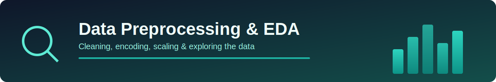

<p align="center">
  
</p>

# 💰 CustomerInsight-AI

### An End-to-End Supervised Machine Learning Pipeline for Loan Approval Prediction


---

## 📌 Overview

**CustomerInsight-AI** is a binary classification project that predicts whether a bank loan application will be **Approved** or **Rejected**, based on applicant demographics, income, credit history, and loan attributes.

The project covers the **complete ML lifecycle** — from raw data cleaning to model comparison — and is built to help financial institutions make faster, data-driven loan eligibility decisions.

> 🎯 **Goal:** Predict `Loan_Approved` (Yes/No) using applicant financial and demographic data.

---

## 🧠 Key Highlights

- ✅ Built an end-to-end supervised ML pipeline using **KNN, Logistic Regression, and Naive Bayes**
- ✅ Performed in-depth **EDA, feature engineering, and data preprocessing**
- ✅ Evaluated models using **Precision, Recall, F1-Score, and Accuracy**
- ✅ Delivered a robust **binary classification system** for loan eligibility prediction with actionable, decision-ready insights

---

## 🗂️ Project Workflow

```
Raw Data
   │
   ▼
Handle Missing Values (Mean / Most-Frequent Imputation)
   │
   ▼
Exploratory Data Analysis (EDA)
   │
   ▼
Outlier Detection (Box Plots)
   │
   ▼
Feature Encoding (Label + One-Hot Encoding)
   │
   ▼
Correlation Analysis (Heatmap)
   │
   ▼
Train-Test Split + Feature Scaling
   │
   ▼
Model Training (KNN | Logistic Regression | Naive Bayes)
   │
   ▼
Model Evaluation & Comparison
```

---

## 🧹 Data Preprocessing

<p align="center">
  
</p>

| Step | Technique Used |
|------|-----------------|
| Missing numerical values | `SimpleImputer(strategy="mean")` |
| Missing categorical values | `SimpleImputer(strategy="most_frequent")` |
| Categorical encoding | `LabelEncoder` + `OneHotEncoder` |
| Feature scaling | `StandardScaler` |
| Train-test split | 80/20 split (`random_state=42`) |

**Dataset size:** 1000 entries · 18 original features (dropped non-predictive `Applicant_ID`)

---

## 📊 Exploratory Data Analysis

A thorough EDA was performed inside the notebook to understand class balance, feature distributions, and relationships with the target variable.

| Analysis | Key Insight |
|----------|-------------|
| 🎯 **Class Balance** (`Loan_Approved`) | Dataset is imbalanced — roughly **70% Rejected** vs **30% Approved** |
| 👥 **Gender & Education distribution** | Majority of applicants are graduates; gender split is moderately skewed |
| 💵 **Applicant / Co-applicant Income** | Fairly uniform spread across income bands, with a spike around ₹10,000–11,000 |
| 📦 **Outlier check (Box Plots)** | `Loan_Amount` and `DTI_Ratio` show visible separation between approved vs rejected groups |
| 💳 **Credit Score vs Approval** | Applicants with **credit scores above ~700** are far more likely to get approved |
| 🔥 **Correlation Heatmap** | `Credit_Score` (+0.45) and `DTI_Ratio` (−0.44) are the strongest predictors of `Loan_Approved` |

> 📓 Full charts (pie charts, bar plots, histograms, box plots, and the correlation heatmap) are available in `CustomerInsight-AI.ipynb`.

---

## 🤖 Models Trained & Evaluated

<p align="center">
  
</p>

Three classification algorithms were trained and benchmarked on the same preprocessed, scaled dataset:

| Model | Precision | Accuracy | Recall | F1-Score |
|-------|-----------|----------|--------|----------|
| Logistic Regression | 0.783 | 0.865 | 0.770 | 0.777 |
| K-Nearest Neighbors (k=5) | 0.627 | 0.760 | 0.525 | 0.571 |
| **Naive Bayes** | **0.804** | **0.865** | **0.738** | **0.769** |

### 🏆 Best Model: **Naive Bayes**
Selected as the best-performing model based on **Precision**, making it the most reliable choice for minimizing false approvals in a lending context.

---

## 🛠️ Tech Stack

- **Language:** Python 3
- **Data Handling:** Pandas, NumPy
- **Visualization:** Matplotlib, Seaborn
- **Machine Learning:** Scikit-learn
  - `SimpleImputer`, `LabelEncoder`, `OneHotEncoder`, `StandardScaler`
  - `LogisticRegression`, `KNeighborsClassifier`, `GaussianNB`
- **Environment:** Jupyter Notebook

---

## 📁 Repository Structure

```
CustomerInsight-AI/
│
├── CustomerInsight-AI.ipynb      # Main notebook (EDA + Modeling)
├── assets/                       # Banner graphics used in this README
├── data/                         # Dataset (if applicable)
└── README.md
```

---

## 🚀 How to Run

```bash
# Clone the repository
git clone https://github.com/<your-username>/CustomerInsight-AI.git
cd CustomerInsight-AI

# Install dependencies
pip install pandas numpy matplotlib seaborn scikit-learn

# Launch the notebook
jupyter notebook CustomerInsight-AI.ipynb
```

---

## 🔮 Future Improvements

- Handle class imbalance using SMOTE / class-weighting
- Hyperparameter tuning (GridSearchCV) for KNN & Logistic Regression
- Try ensemble models (Random Forest, XGBoost)
- Deploy as a Flask/Streamlit web app for live predictions

---

## 👤 Author

**Made with ❤️ by [Sayan](https://www.linkedin.com/in/sayanpal04?utm_source=share_via&utm_content=profile&utm_medium=member_android)**

Connect with me on **[LinkedIn](https://www.linkedin.com/in/sayanpal04?utm_source=share_via&utm_content=profile&utm_medium=member_android)** 🚀

---

<p align="center">⭐ If you found this project useful, consider giving it a star!</p>
